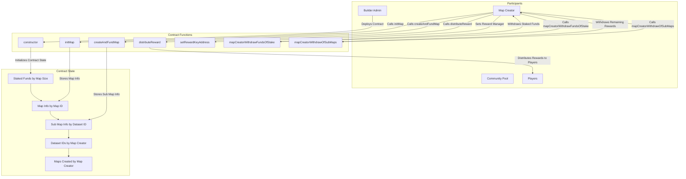

# R3v3alfunds Smart Contract

## Overview

The `R3v3alfunds` smart contract is designed to manage the staking, creation, and rewarding of map-based games. The contract facilitates the interactions between the builder admin, map creators, a community pool, and players.

## Key Features

- **Map Initialization**: Allows map creators to initialize new maps with required staked funds.
- **Sub-map Creation and Funding**: Enables map creators to create and fund sub-maps.
- **Reward Distribution**: Distributes rewards to players based on winning coordinates.
- **Withdrawal**: Allows map creators to withdraw staked funds and remaining rewards after specific periods.

## Contract Details

### Participants

- **Builder Admin**: Deploys and manages the contract.
- **Map Creator**: Creates and funds maps and sub-maps.
- **Community Pool**: Receives a portion of the staked funds.
- **Players**: Participate in the game and receive rewards.

### Contract State Variables

- **Builder Admin**
- **Lock Period**
- **Return Ratio**
- **Community Pool**
- **Staked Funds by Map Size**
- **Map Info by Map ID**
- **Sub Map Info by Dataset ID**
- **Dataset IDs by Map Creator**
- **Maps Created by Map Creator**

### Key Functions

- **constructor**: Initializes the contract.
- **initMap**: Initializes a new map.
- **createAndFundMap**: Creates and funds a sub-map.
- **distributeReward**: Distributes rewards to players.
- **setRewardKeyAddress**: Sets a new reward manager.
- **mapCreatorWithdrawFundsOfStake**: Withdraws staked funds after the lock period.
- **mapCreatorWithdrawOfSubMaps**: Withdraws remaining rewards after the game period.

## Diagram

The following diagram illustrates the interactions between participants and the smart contract functions:



## Deployment

To deploy the contract, use the following command:

```bash
npx hardhat run scripts/deploy.js --network <network-name>
```

## Testing

To run tests for the contract, use the following command:

```bash
npx hardhat test
```

## License

This project is licensed under the MIT License.
